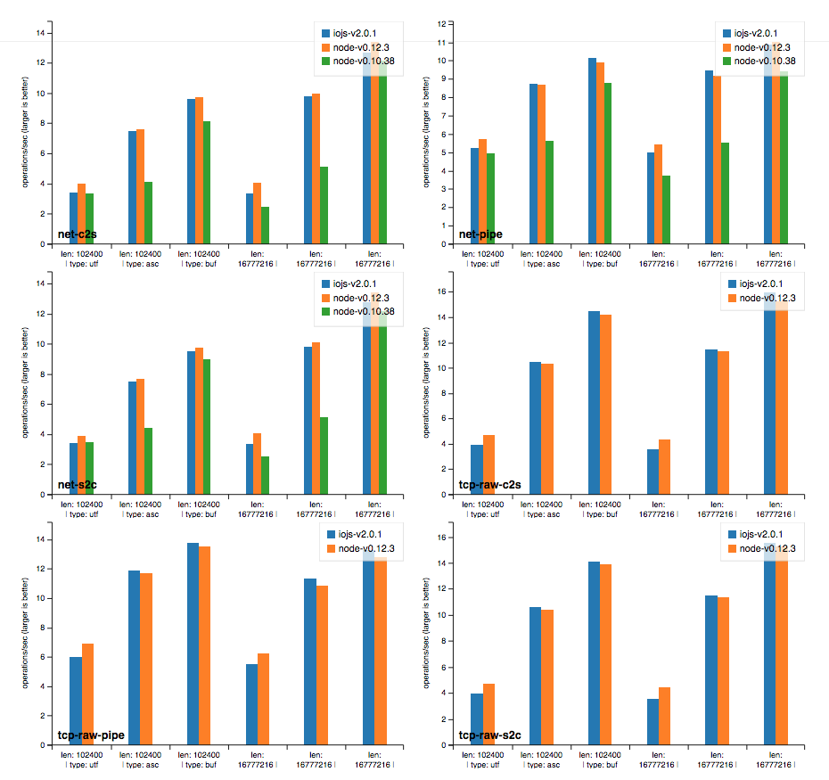

# benchgraph

Runs {io,node}.js benchmarks and generates pretty graphs

## Notes on Benchmarks

The benchmarks were copied from the io.js repo (v2.0.1) and slightly adapted.

Some of them don't run with `node-v0.10` or even `node-v0.12`. When only `0.10` failed the data was included, but the
graph only compares io.js and node-v0.12 obviously.

When both failed the data has not been included at all, namely for the following:

- url *fail due to `v8 module not found`*
- querytstring *fail due to `v8 module not found`*
- crypto/rsa-encrypt-decrypt-throughput
- http/http-server-for-chunky-client *produces no data ATM*

## License

MIT
